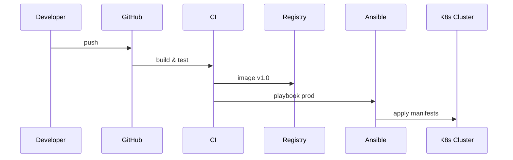

# Cours : Transition vers l’Infrastructure as Code (IaC)

> **Objectif** : acquérir une compréhension opérationnelle d’un workflow complet IaC couvrant : design/containérisation (Docker & docker‑compose) → tests & sécurité (CI/CD GitHub Actions) → déploiement (Ansible) → orchestration (Kubernetes).

---

## 1 · Introduction : pourquoi l’IaC ?
- **Problèmes de l’approche manuelle** : dérive de configuration, reproductibilité impossible, délais.
- **Bénéfices IaC** : infra décrite comme du code ⇒ versionnée, peer‑review, rollback. Automatisation, scalabilité, audit.
- **Outils & piliers** : Git / Docker / CI‑CD / Ansible / Kubernetes.

### Atelier éclair
```bash
# Cloner le dépôt « iac‑workshop »
git clone https://github.com/Maissacrement/cyber_sec_master_spv.git && cd cyber_sec_master_spv
```
Objectif : valider que tout le monde a Git & Docker installés ("Hello‑World" container).

---

## 2 · Docker : des conteneurs à l’image
### 2.1 Dockerfile pas à pas
| Instruction | Rôle | Exemple |
|-------------|------|---------|
| `FROM` | Image de base | `FROM python:3.12-slim` |
| `RUN` | Commande à la construction | `RUN apt-get update && apt-get install -y git` |
| `COPY` | Copier des artefacts | `COPY app/ /app/` |
| `ENTRYPOINT` | Commande de lancement | `ENTRYPOINT ["python","app.py"]` |

```dockerfile
# docker/Dockerfile
FROM python:3.12-slim
WORKDIR /app
COPY requirements.txt .
RUN pip install -r requirements.txt
COPY . .
ENTRYPOINT ["python","app.py"]
```

### 2.2 docker‑compose : architecture multi‑services
```yaml
version: "3.9"
services:
  web:
    build: ./docker
    ports: ["8000:8000"]
    depends_on: [db]
  db:
    image: postgres:16
    environment:
      POSTGRES_PASSWORD: example
volumes: {}
networks: {}
```
`docker compose up -d` ⇒ tout l’environnement s’instancie.

---

### 2.3 Réseau Docker (CIDR, bridge, etc.)

Docker isole les conteneurs dans des réseaux virtuels et attribue des adresses IP issues d’un **CIDR** (Classless Inter‑Domain Routing) — notation qui combine l’adresse réseau et le masque, ex. `172.17.0.0/16`.

| Mode réseau | Description | CIDR / Exemple par défaut | Cas d’usage |
|-------------|-------------|---------------------------|-------------|
| **bridge** *(par défaut)* | Crée un pont virtuel (`docker0`) ; chaque conteneur reçoit une IP privée routée via NAT vers l’hôte. | `172.17.0.0/16` | Dev local, isolation légère |
| **host** | Conteneur partage la pile réseau de l’hôte (pas d’IP dédiée). | n/a | Performances, écoute ports <1024 |
| **none** | Pas d’interface réseau auto ; conteneur isolé. | n/a | Sécurité, sandbox |
| **overlay** | Réseau distribué pour un swarm / multi‑hôtes. | `10.0.0.0/24` (ex.) | Cluster, micro‑services |
| **macvlan** | Conteneurs ont leur MAC / IP du LAN physique. | dépend LAN | Applis nécessitant L2 (DHCP, broadcast) |

#### 2.3.1 Sous‑réseaux personnalisés
```bash
# Créer un réseau bridge dédié sur 10.10.0.0/24
docker network create \
  --driver bridge \
  --subnet 10.10.0.0/24 \
  --gateway 10.10.0.1 \
  mynet

# Lancer un conteneur dedans
docker run -d --name web --network mynet nginx
```
`docker inspect mynet` montre la configuration (CIDR, gateway, containers attachés).

#### 2.3.2 Publier des ports 🔀
- **`-p 8080:80`** ⇒ mappe *port hôte 8080* vers *port conteneur 80*.
- **`-p 127.0.0.1:3306:3306`** ⇒ n’écoute que sur localhost.

#### 2.3.3 docker‑compose & networks
```yaml
services:
  app:
    build: .
    networks:
      - back
networks:
  back:
    driver: bridge
    ipam:
      config:
        - subnet: 10.20.0.0/24
```
Compose crée automatiquement un DNS interne ; `app` peut joindre `db:5432` par le nom du service.

*Tips* :
- Vérifier les conflits CIDR avec VPN/entreprise.
- Utiliser `--icc=false` et `--iptables` pour durcir l’isolation.

#### 2.3.4 Résolution de noms de service (DNS interne)
Docker embarque un **serveur DNS interne** (à l’adresse `127.0.0.11` dans chaque conteneur) qui fournit la **découverte de services** :

| Contexte | Nom à utiliser | Exemple |
|----------|----------------|---------|
| **Bridge ou overlay user‑defined** | *Nom du conteneur* ou *nom du service compose* | `curl http://web:8000` |
| Même conteneur sur plusieurs réseaux | FQDN `<container>.<network>` | `ping db.mynet` |
| Alias définis dans compose | Valeur dans `aliases:` | `redis-cache` |

> Les réseaux créés par `docker-compose` ajoutent automatiquement un domaine de recherche : `<project>_default`. Ainsi le service `db` devient résolvable via `db` ou `db.<project>_default`.

```yaml
services:
  web:
    build: .
    networks:
      back:
        aliases: [api.local]
  db:
    image: postgres
networks:
  back:
    driver: bridge
```
Dans le conteneur `web` :
```bash
# Résolution automatique par le DNS Docker
ping db          # ↪ 10.20.0.2
curl http://api.local:8000
```

**Important :** la résolution ne fonctionne *que* pour les conteneurs connectés au *même réseau utilisateur* (bridge/overlay). Les conteneurs sur le réseau par défaut `bridge` et un réseau personnalisé ne se voient pas sans y être connectés tous les deux.

Pour diagnostiquer :
```bash
# Lister les entrées DNS vues par le conteneur
cat /etc/resolv.conf
# Tester
getent hosts db
```

---
- Vérifier les conflits CIDR avec VPN/entreprise.
- Utiliser `--icc=false` et `--iptables` pour durcir l’isolation.

---

## 3 · CI / CD avec GitHub Actions
### 3.1 Pipeline minimal
```.github/workflows/ci.yml
name: Docker Image CI

on:
  push:
    branches: [ "main" ] # l'action s'execute a chaque push sur main
  pull_request:
    branches: [ "main" ] # l'action s'execute a chaque pull request sur main

jobs:

  build:

    runs-on: ubuntu-latest

    steps:
    - uses: actions/checkout@v3
    - name: Made SAST docker running catainer analysis
      run: make workflow-attack-example running-container-analisis stop-workflow-attack-example # la commande est sensé marché pour tout utilisateur present dans la racine du projet
    - name: Made SAST docker-compose file analysis
      run: make workflow-attack-example run-project-analysis stop-workflow-attack-example # la commande est sensé marché pour tout utilisateur present dans la racine du projet
    - name: Try to compile attacker
      run: docker build . --file ./docker/Dockerfile.attack --tag attacker:$(date +%s) # On construit l'image pour savoir si elle, se construit de la meme façon sur une autre machine
```

#### 3.1.1 Comprendre le runner : petite démo *shell*
Un **runner GitHub** est une machine virtuelle éphémère (Ubuntu 22.04, Windows ou macOS) démarrée à chaque workflow, **gratuite** pour les dépôts publics. Elle part d’un disque propre ; vos commandes s’exécutent donc dans un environnement sain, idéal pour vérifier que votre projet est vraiment reproducible.

Ajoutons une étape `ls` pour illustrer :
```yaml
actions:
  build:
    runs-on: ubuntu-latest
    steps:
      - uses: actions/checkout@v4
      # ... build et scans …
      - name: Inspecter le workspace
        run: |
          echo "Contenu du répertoire de travail (runner GitHub) :" 
          ls -lah
```
- **`runs-on: ubuntu-latest`** : réserve un VM Linux dans le cloud.
- **`run:`** : exécute des commandes shell directement dans cet hôte.
- L’étape `checkout` clone votre dépôt ; l’instruction `ls` prouve que le code est bien présent et que vous n’êtes *pas* sur votre poste local.

> Grâce à cet environnement immuable, les tests, l’analyse statique et la construction d’images se déroulent toujours dans les mêmes conditions ➜ **qualité + versionning fiables**.

### 3.2 Stratégie de branches
`main` protégé ; `feature/*` ⇒ PR + checks verts obligatoires.

---

## 4 · Ansible – déploiement automatisé

### 4.1 Pourquoi Ansible ?
Ansible est un **outil d’automatisation** agent‑less : pas de démon à installer sur les machines cibles, une simple connexion SSH (ou `local`) suffit. Il décrit l’état désiré dans des **playbooks** YAML et garantit l’idempotence – rejouable sans effets de bord.

### 4.2 Concepts clés
| Terme | Rôle | Exemple |
|-------|------|---------|
| **Inventaire** | Liste d’hôtes ou groupes | `localhost`, `webservers` |
| **Module** | Unité d’action (apt, copy, docker_compose…) | `apt`, `community.docker.docker_compose` |
| **Playbook** | Scénario regroupant tâches & variables | `deploy/local.yml` |
| **Rôle** | Collection réutilisable de tâches/handlers | `geerlingguy.postgresql` |

### 4.3 Utiliser Ansible en **local**
```yaml
# playbooks/setup_local.yml
- name: Provisionner localhost
  hosts: localhost
  connection: local
  gather_facts: false
  tasks:
    - name: Installer htop
      become: yes
      apt:
        name: htop
        state: present

    - name: Exécuter un ls pour vérification
      shell: |
        ls -lah
        uname -a
```

Exécution :
```bash
ansible-playbook playbooks/setup_local.yml
```

### 4.4 Déploiement Docker avec `community.docker.docker_compose`
```yaml
# deploy/compose.yml
- name: Déployer les conteneurs de l’application
  hosts: localhost
  connection: local
  gather_facts: false
  tasks:
    - name: Lancer l’environnement compose
      community.docker.docker_compose:
        project_src: ../
        state: present
```

### 4.5 Sécurisation de base
```yaml
- name: Sécuriser la machine
  hosts: localhost
  become: yes
  tasks:
    - name: Mettre à jour les paquets
      apt:
        update_cache: yes
        upgrade: dist

    - name: Installer Fail2ban
      apt:
        name: fail2ban
        state: present
```

### 4.6 Intégration dans la CI / CD
Dans GitHub Actions, un job `ansible` peut exécuter :
```yaml
- uses: actions/setup-python@v5
- name: Install Ansible
  run: pip install ansible ansible-lint
- name: Run playbook
  run: ansible-playbook deploy/compose.yml -e "@vars/prod.yml"
```
Lint automatique :
```bash
ansible-lint playbooks/  # déclenché dans la pipeline
```

---
## 5 · Kubernetes · Kubernetes
### 5.1 Pourquoi migrer ?
Limites de docker‑compose : scaling, auto‑healing, rolling update.

### 5.2 Minikube local
```bash
minikube start --driver=docker
```

### 5.3 Déployer « web » + Postgres
`k8s/deployment.yaml`, `k8s/service.yaml`, `k8s/ingress.yaml` (avec Ingress‑NGINX).

---

## 6 · Chaîne complète : de l’IDE à la prod
1. Développer ➜ commit/push.
2. CI : build + tests + scan.
3. CD : tag « v* » déclenche job Ansible `--limit=prod`.
4. Kubernetes : rolling update.

Diagramme :


---

## 7 · Ressources
- Documentation officielle : Docker, GitHub Actions, Ansible, Kubernetes.
- Guides Sécurité : CIS Docker 1.5 benchmark, Snyk kube.
- Outils : Trivy, Hadolint, ansible‑lint, kube‑score.

---

> Fin du cours – version 0.1
> *Dernière mise à jour : 28 avril 2025*


# Introduction à Kubernetes

Lorsque les applications deviennent plus complexes (multi-conteneurs, besoin d'auto-scaling, haute disponibilité, etc.), **Kubernetes** s'impose naturellement comme une suite logique à **docker-compose**.

**Kubernetes** est un orchestrateur de conteneurs qui :
- Déploie,
- Gère,
- Met à l’échelle,
- Et supervise vos applications conteneurisées.

En simplifié :
- **Docker-compose** décrit des **services** dans un fichier YAML.
- **Kubernetes** décrit des **déploiements** et des **services**... également en YAML, mais avec plus de puissance et de contrôle.

| Concept docker-compose | Concept Kubernetes équivalent |
|:------------------------|:-------------------------------|
| `services:`             | `Deployment` + `Service`        |
| `volumes:`              | `PersistentVolumeClaim (PVC)`   |
| `networks:`             | `ClusterIP / NodePort / Ingress` |

Ainsi, migrer de **docker-compose** à **Kubernetes** reste naturel, même si Kubernetes apporte plus de fonctionnalités avancées.

---

# Minikube : Kubernetes local

Pour tester Kubernetes localement sans infrastructure lourde, **Minikube** est la solution idéale.

Minikube :
- Lance un **cluster Kubernetes complet** sur votre machine, dans une VM ou un conteneur Docker.
- Permet de développer et tester des applications Kubernetes **localement**, comme si vous étiez sur un cloud public.

**Installation rapide de Minikube :**
```bash
# Sur Linux/Mac
curl -LO https://storage.googleapis.com/minikube/releases/latest/minikube-linux-amd64
sudo install minikube-linux-amd64 /usr/local/bin/minikube

# Démarrer un cluster
minikube start
```

---

# Déployer et exposer un service sur Kubernetes

Le minimum pour déployer une application sur Kubernetes est :

1. **Un fichier Deployment YAML** pour décrire comment lancer vos conteneurs :
```yaml
apiVersion: apps/v1
kind: Deployment
metadata:
  name: my-app
spec:
  replicas: 1
  selector:
    matchLabels:
      app: my-app
  template:
    metadata:
      labels:
        app: my-app
    spec:
      containers:
      - name: my-container
        image: myimage:latest
        ports:
        - containerPort: 80
```

2. **Un fichier Service YAML** pour rendre votre application accessible :
```yaml
apiVersion: v1
kind: Service
metadata:
  name: my-app-service
spec:
  type: NodePort
  selector:
    app: my-app
  ports:
  - port: 80
    targetPort: 80
    nodePort: 30080
```

Une fois appliqué (`kubectl apply -f .`), vous pourrez accéder à votre service via :
```bash
minikube service my-app-service
```
Cela ouvre automatiquement l’URL de votre application dans le navigateur.

---


